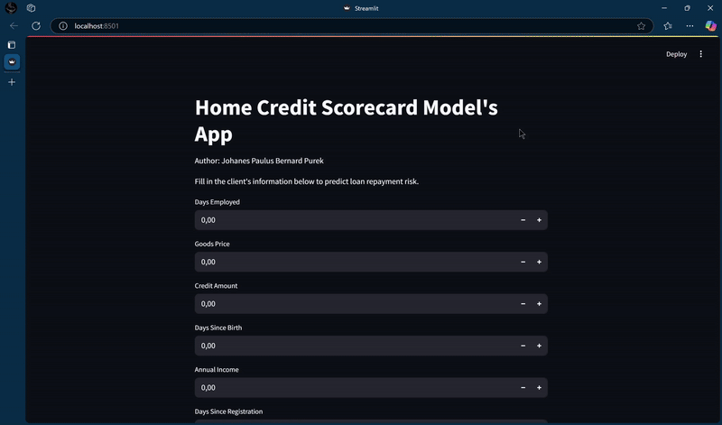

# Home Credit Scorecard Model's Prediction

A data science & machine learning project designed to predict the repayment risk of loan applicants at Home Credit Indonesia. This solution leverages real-world credit application data and statistical modeling to enhance financial inclusion while reducing risk.

---

## 🚀 Demo
This project represents my first attempt at using Streamlit to deploy a machine learning model locally on my machine (localhost). I also explored deployment on Streamlit Cloud; however, the pickle model file was approximately 500 MB, exceeding GitHub’s 100 MB file size limit, which prevented successful deployment. I explored alternative approaches but encountered similar challenges. I am continuing to learn and improve my deployment skills, and I plan to deploy models from future projects to Streamlit Cloud successfully.

<p align="left">
  
</p>

---

## 📑 Table of Contents
- [Business Understanding](#-business-understanding)
- [Data Understanding](#-data-understanding)
- [Approach](#-approach)
- [Visualizations](#-visualizations)
- [Business Recommendation](#-business-recommendation)
- [Technologies Used](#-technologies-used)
- [Setup Instructions](#-setup-instructions)
- [Project Status](#-project-status)
- [Credits](#-credits)

---

## 🧠 Business Understanding

Many individuals in Indonesia face difficulty obtaining loans due to limited or no credit history. This project helps Home Credit Indonesia assess the creditworthiness of such clients using machine learning rather than traditional scoring, ensuring that those with the ability to repay are not unjustly rejected. The goal is to deliver safer, smarter lending opportunities and provide a structured repayment framework for customer success.

---

## 📊 Data Understanding

The dataset consists of 307,511 loan applications with 122 original features. After cleaning and transformation, 71 features were retained, including demographics, employment history, loan details, and social behavior. At the preprocessing stage, only the top 20 columns were selected based on the score and p-value, for the training process.

- Target variable: `TARGET` (1 = payment difficulties, 0 = no difficulties)
- Source: Home Credit Indonesia

---

## ⚙ Approach

This project followed an end-to-end data science pipeline as illustrated below:

1. Importing Libraries & Data
- Loaded both train and test datasets
- Checked data types and overall structure

2. Data Preparation & Cleaning
- Analyzed dataset summary statistics
- Handled missing values:
  - Dropped columns with >50% missing values
  - Imputed remaining nulls using median-mode
- Removed duplicated records
- Detected outliers and skewed distributions
- Dropped low-correlation numeric columns with noise
- Added new features such as AGE from DAYS_BIRTH

3. Exploratory Data Analysis (EDA) & Business Insight
- Checked correlation matrix using heatmaps
- Visualized key features with:
  - Univariate, Bivariate, and Multivariate analysis
- Derived actionable business insights (e.g., income type, contract type vs. default risk)

4. Model Building & Selection
- Split categorical and numerical features
- Encoded categorical variables using Label Encoding
- Performed Feature Selection using Chi-square test (top 20 features selected)
- Addressed class imbalance by resampling data
- Scaled numerical data using StandardScaler
- Trained four models: Logistic Regression, Random Forest, Gradient Boosting, and K-Nearest Neighbor
- Selected Random Forest as the best model based on ROC-AUC and accuracy

5. Dataset Test Prediction
- Applied the same cleaning and encoding process to test set
- Used trained model to predict repayment abilities of new applicants
- Made final business recommendations for Home Credit to minimize loan risk

6. Final deployment with Streamlit UI in local computer

---

## 📸 Visualizations

- Histogram showing Number of Clients Repayment Abilities By Age Interval(No Difficulties)

Most loan applicants are between 35 and 40 years old, followed by those aged 40 to 45. Conversely, very few applications come from clients younger than 25 or older than 65. Clients aged 35-45 generally do not struggle with repayments.


  - Histogram showing Number of Clients Repayment Abilities By Age Interval(Have Difficulties)

Clients aged 25-35 are more likely to face difficulties.


- Column Chart showing Number of Clients Repayment Abilities By Educational Type

Clients with lower secondary education have the highest repayment difficulties (11%), despite most applicants having a secondary education(218K).


- CatPlot showing multivariate analysis between Income Type, Amount Credit of Loan, Target, and Contract Type

Among clients on maternity leave with cash loans, all face repayment difficulties for medium credit amounts, whereas those with revolving loans have no such issues.  
More than half of unemployed clients with cash loans struggle with repayment on medium credit amounts, while all unemployed clients with revolving loans repay without problems.  
All student clients manage to repay their loans, whether cash or revolving, for low to medium credit amounts.


- Feature importance rankings

Using the top 20 column selected based on the score and p-value, for the training process. 5 most important features: EXT_SOURCE_2, EXT_SOURCE_3, DAYS_BIRTH, DAYS_ID_PUBLISH, & DAYS_REGISTRATION.


- Model prediction summary

The Random Forest model was identified as the best-performing model. The 2.34% error margin indicates a wellbalanced performance, with no signs of underfitting or overfitting. Moving forward, this model will be used to predict the clients repayment abilities using application_test dataset.


---

## 💡 Business Recommendation

1. Since younger clients (25-35 years old) and those with lower secondary education have higher loan repayment difficulties, Home Credit should implement stricter risk assessment measures for these groups. This could include offering smaller initial loan amounts, requiring financial literacy training, or providing flexible repayment plans to improve repayment success rates.
2. Given that women hold the majority of loans and have a lower default rate than men, Home Credit could consider expanding loan programs specifically tailored for female borrowers. Offering incentives like lower interest rates or financial education programs could further enhance repayment rates and financial inclusion for women.
3. Since repayment success improves with higher income, Home Credit should consider incomesensitive loan products. For example, unemployed clients and those on maternity leave should have customized repayment plans, such as deferred payments or income-adjusted installments, to reduce the likelihood of default while still allowing access to financial services.
---

## 🛠 Technologies Used

- Python
- Pandas, NumPy, Matplotlib, Seaborn
- Scikit-learn
- Joblib
- Streamlit
---

## ⚙ Setup Instructions

1. Clone the repository:
     For the updated notebook, use this [Colab Notebook](https://colab.research.google.com/drive/19q-9IvkgemOsgGdQFgpDMoDtr9ritpkB?usp=sharing)
2. Download the dataset
3. Download the encoders from this repository. For the model itself, you can import it by running the code in colab
4. Install dependencies:
   ```bash
   pip install -r requirements.txt
5. Run the app locally:
   ```bash
   streamlit run app.py

## 📌 Project Status
✅ Completed  
📈 Final model: Random Forest with 20 selected features and balanced dataset using resampling  
🧪 Evaluated on an unseen test set with high ROC-AUC and generalization

## 💯 Credits
- Home Credit Indonesia for the dataset and case study
- Rakamin Academy for facilitating the project
